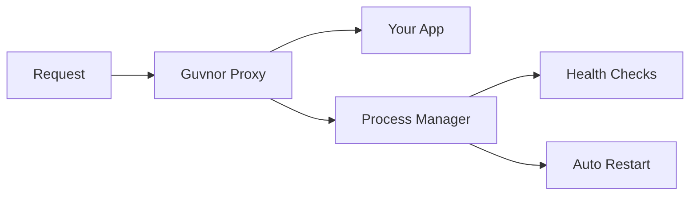

# Guvnor

Process manager and reverse proxy in one binary.

## Quick Start

```bash
cd your-project
guvnor init
guvnor start
```

Visit `http://your-project.localhost:8080`

## Features

- Auto-detects Node.js, Python, Go, Rust, PHP, Java
- Process management with health checks
- Virtual host routing
- Automatic HTTPS via Let's Encrypt
- Zero dependencies

## Installation

=== "Download Binary"

    ```bash
    curl -sSL https://github.com/gleicon/guvnor/releases/latest/download/guvnor-$(uname -s)-$(uname -m) -o guvnor
    chmod +x guvnor
    sudo mv guvnor /usr/local/bin/
    ```

=== "Install with Go"

    ```bash
    go install github.com/gleicon/guvnor/cmd/guvnor@latest
    ```

## Commands

```bash
guvnor init                 # Generate config
guvnor start [app]          # Start apps
guvnor stop [app]           # Stop apps
guvnor status [app]         # Show status
guvnor logs [app]           # View logs
```

## Quick Examples

=== "New Project"

    ```bash
    mkdir my-app && cd my-app
    echo 'console.log("Hello")' > server.js
    guvnor init && guvnor start
    # Visit: http://my-app.localhost:8080
    ```

=== "Existing Project"

    ```bash
    cd my-existing-project
    guvnor init      # Auto-detects your app
    guvnor start     # Runs with smart defaults
    ```

=== "Production"

    ```bash
    guvnor start --domain myapp.com --email admin@myapp.com
    # Automatic HTTPS with Let's Encrypt
    ```

## Configuration

```yaml title="guvnor.yaml"
apps:
  - name: web
    hostname: web.localhost
    command: node
    args: ["server.js"]
    
  - name: api
    hostname: api.localhost
    command: uvicorn
    args: ["main:app"]
    tls:
      enabled: true
      auto_cert: true
```

## How It Works



1. **Detects your apps** - Scans project files
2. **Generates config** - Smart defaults
3. **Starts processes** - With monitoring
4. **Routes requests** - By hostname
5. **Handles HTTPS** - Automatic certificates

Config priority: `guvnor.yaml` > `Procfile` > auto-detect